<b>SERVICE REGISTER — all 26 systems</b>

 

| No. | System | Zone | Status | Input → Output |
|:--|:--|:--|:--|:--|
| 101 | Corporate Auto-Onboarding | Service Core | Operational | Employee ID, department, M365 email → ~25 endpoints per run, one packaged process |
| 102 | Corporate Auto Policy / Security Automation | Service Core | Operational | Endpoint policy set → USB controls, monitoring, system configuration — bundled, headless |
| 103 | Asset Management System | Service Core | Operational | On-prem devices and operational requirements → Asset register with tailored plugins, zero licence cost |
| 104 | Ticketing System | Service Core | Operational | Structured ticket intake → Technician context on arrival; events classified into 4 priority tiers; WhatsApp (Twilio) and Telegram notifications via webhooks |
| 105 | E-Commerce Processing System | Service Core | Deploying | High-volume product data → Structured catalogue at bulk throughput |
| 201 | SOC / Endpoint Security Platform | Security Perimeter | Operational | Endpoint telemetry → Layered detection, monitoring, response; Tactical RMM across internal and external networks |
| 202 | IAS — Intrusion Alert System | Security Perimeter | Operational | Server events → Intrusion alerts through an 8-layer architecture |
| 301 | Local Document / PDF Tooling | Document Room | Operational | Employee documents → PDF conversion, editing, watermarking and signing on a local server |
| 302 | Agent Flow | Document Room | Operational | Agency documents (OCR) → Structured Excel for Salesforce migration |
| 303 | CAD Drawing Auto-Documentation | Document Room | Deploying | CAD drawings and specifications (precision OCR) → Populated structured documentation |
| 304 | AMSIH-one PDF Editor | Document Room | Operational | PDF → Lightweight PDF editing, practical everyday tools |
| 401 | HayaScope HyperSync | Tool Workshop | Deploying | Any page, region, window, tab set or URL list → Annotated PNG / JPG / PDF (continuous or A4), clipboard, print, email — all processed locally |
| 402 | Android Mobile Browser SDK | Tool Workshop | Deploying | Web → No ads, no bloat, no popups; tracker blocking; anonymous browsing |
| 403 | Browser Extension / Themes | Tool Workshop | Operational | Working environment → Dense astrophotography starfield; calm animated starfield |
| 404 | Renata Code | Tool Workshop | In test | PHP, Python, HTML source → Live rendered output beside the code |
| 405 | HayaSnap Pro | Tool Workshop | Operational | Screen → Capture utility |
| 406 | OMZ — Open My Zip | Tool Workshop | Operational | Archive → Archive utility |
| 407 | StayAwake | Tool Workshop | Operational | System sleep policy → Advanced alternative to simple keep-awake utilities |
| 408 | KUBOS Workspace Cube | Tool Workshop | Operational | Workspace → Workspace utility |
| 501 | Immersive 3D Website | Annex | Operational | Scroll position → Camera path through a lit WebGL scene; GLTF/GLB, Draco, rAF-optimised |
| 502 | Haya-Tower-Garden | Annex | Deploying | Real-estate model → Immersive 3D real-estate experience |
| 503 | YOLO 3D Scanning | Annex | Deploying | Camera feed → Warehouse / product inventory check via 3D scanning |
| 504 | Project Opus | Annex | Deploying | Audio (tune, pitch) → Rhythm visualisation with automatic asset matching |
| 505 | Local RAG / AI Agent Orchestration | Annex | Operational | Local corpus and agent tasks → Real-time agent orchestration behind a WebGL 3D interface |
| 506 | AI Training / Optimisation Mechanics | Annex | In test | Generated synthetic training data → Automated feedback loops for downstream model behaviour |
| 507 | Huawei Watch Face | Annex | Operational | Time → Custom watch face |

Confidential work is not listed. Figures that have not been characterised are not shown.

<b>ABSAAR IT</b> &nbsp;·&nbsp; PRINCIPAL SOFTWARE ARCHITECT &amp; INFRA DEVOPS &nbsp;·&nbsp; <a href="mailto:i@absaar.dev">i@absaar.dev</a> &nbsp;·&nbsp; <a href="https://absaar.dev">absaar.dev</a> &nbsp;·&nbsp; github.com/absaar-404 
Cards are generated from <code>tools/console</code>; telemetry refreshes daily. Where a required tool did not exist, it was built.

